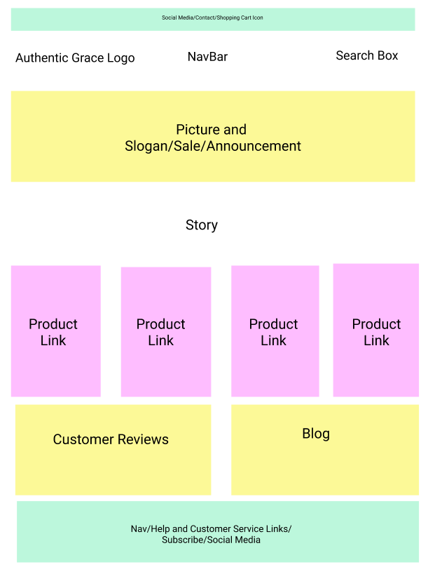

# AuthenticGrace

View on Netlify at https://authentic-grace-2.netlify.com/

## About the project

Authentic Grace is a fictional brick-and-mortar clothing store that needed a website to establish an online presence. The front-end of the website was built by Sherry Nance and Almarose Revives as the product of an assigment in Cohort 4 of The Moms Can: Code School.

The goal of the project was to design and develop a website for a Charleston based boutique clothing store named Authentic Grace.

Description: Name of the company is Authentic Grace, a small family owned business in Charleston, SC. We have a fun and creative boutique selling women’s clothing that we started in 2013. We purchase our own inventory and we work hard to find styles that will make you excited about shopping with us.

We will need a way for people to purchase our clothes online and I would love to have a blog so that I can introduce new items and increase our brand visibility. At this time we don’t have a website. We would really like a site that has pretty images of our clothing and simple design so that the images speak for themselves.

Buyer Persona: Erin, 37, a fit and active woman with two children under the age of 6. She loves to add pieces to her wardrobe that won’t break the bank and are easily washed. She has a classic style and likes to mix in a few trendy pieces. At this time she is a stay at home Mom but she still wants to look stylish and not get stuck in the Mom. She loves entertainment TV and her favorite blogs to follow are Ivory Lane, 9to5chic and Hello Fashion.

The customer requested the following features:

-Straightforward logical web structure.

-Responsive Web Design

-Prominent Navigation Bar

-Consistent Theme

-Images

-Social media links

-Footer

-Contact info for the store

-Customer testimonials

## Wirefame

## Contact

Sherry Nance

Portfolio: https://sherrynance.github.io/Portfolio/

Github: sherrynance

Twitter: @sherry_nance

Almarose Revives

GitHub: arevives

Twitter: @AlmaroseR
